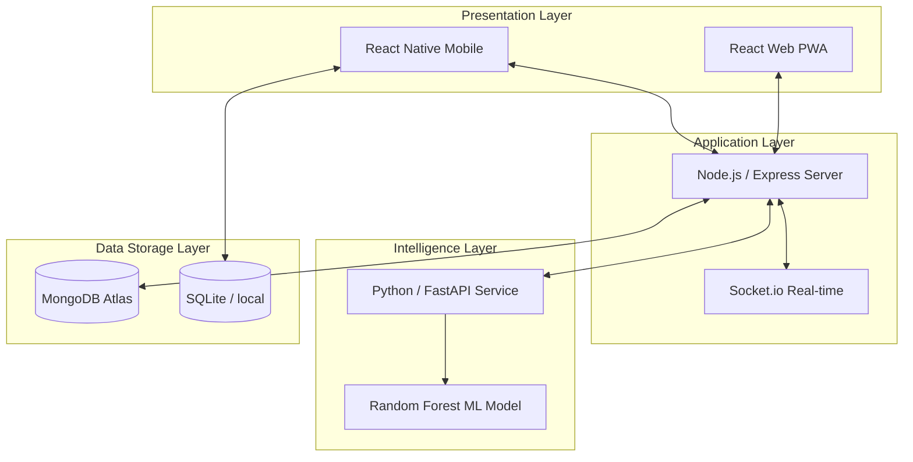
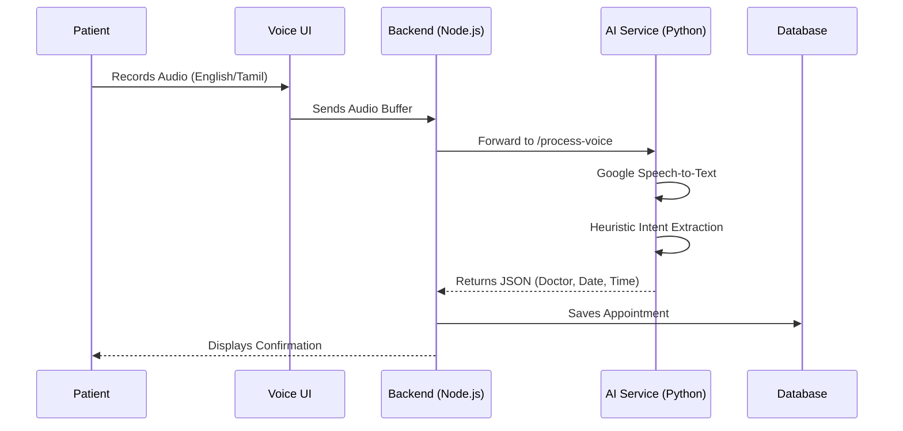

# 🏥 HealthHub: Intelligent Healthcare Management System
### Presentation Outline & PPT Structure

---

## 🖥 Slide 1: Title Slide
- **Project Title**: HealthHub: A Full-Stack AI-Driven Healthcare Ecosystem
- **Subtitle**: Optimizing Appointments through NLP Voice Booking & Predictive Reliability Scoring
- **Presented By**: [Your Name/Team Name]
- **Date**: April 2026

---

## 📝 Slide 2: Introduction
- **Overview**: HealthHub is a comprehensive healthcare platform designed to bridge the gap between patients, doctors, and donors.
- **Key Focus**: Seamless user experience, offline-first architecture, and intelligent automated scheduling.
- **Scope**: Covers clinical management, donor networks, and AI-powered predictive analytics.

---

## 🚨 Slide 3: Problem Statement
- **Inefficiency in Scheduling**: High "no-show" rates in clinics lead to lost revenue and idle resources.
- **Accessibility Barriers**: Traditional digital booking is often cumbersome for non-technical users or those speaking regional languages.
- **Fragmented Donor Networks**: Vital seconds are lost when searching for nearby blood/milk donors during emergencies.

---

## 🎯 Slide 4: Objectives
- To implement **AI-powered reliability scoring** to predict and manage patient attendance.
- To provide a **Multilingual Voice-Encoded Assistant** (English/Tamil) for simplified appointment booking.
- To create a **Geolocation-based Donor Network** for real-time discovery of critical medical resources.
- To implement **Advanced Clinical Security** using AES-256 encryption and managed admin onboarding for doctors.
- To ensure **Offline-First stability** for mobile and web users.

---

## 📄 Slide 5: Abstract / Overview
- **The Ecosystem**: A three-tier architecture connecting a React Web PWA, an Expo Mobile App, and a Python AI Microservice.
- **Feature Highlights**: Automated clinical triage, Random Forest based risk assessment, and integrated maps for donor tracking.

---

## 📚 Slide 6: Literature Review
- **AI in Healthcare**: Current trends focus on diagnostics; HealthHub shifts focus to **operational efficiency**.
- **Voice UI**: Leveraging NLP (Natural Language Processing) to make healthcare inclusive.
- **Geospatial Indexing**: Utilizing MongoDB's `2dsphere` for high-performance radius searches.

---

## 🧪 Slide 7: Methodology / Module Design
- **Agile Development**: Iterative implementation of Mobile-Web feature parity.
- **Voice Intelligence Layer**: Modular component design for the NLP Voice Assistant.
- **Geospatial Engine**: 2dsphere indexing for high-performance SmartMatch discovery.
- **Identity Sync Module**: Cross-platform avatar and profile synchronization.

---

## 🏗 Slide 8: System Architecture (The 4-Layer Stack)

- **1. Presentation Layer (Frontend)**: 
    - React.js + Vite for a high-performance Web PWA.
    - React Native + Expo for native mobile experience.
    - Tailwind CSS for modern, responsive aesthetics.
- **2. Application Layer (Backend API)**:
    - Node.js & Express server handling multi-role logic and routing.
    - Socket.io for real-time synchronization and emergency heart-rate/triage alerts.
- **3. Intelligence Layer (AI Microservice)**:
    - Python & FastAPI handling high-computation NLP and ML tasks.
    - Scikit-learn Random Forest model for reliability predictions.
- **4. Data Storage Layer (Persistence)**:
    - **Primary**: MongoDB (NoSQL) with 2dsphere indexing for global donor discovery.
    - **Security Layer**: AES-256 CBC symmetric encryption at rest for PII (Personally Identifiable Information).
    - **Local**: SQLite & AsyncStorage for offline-first mobile reliability.

---

## 🧩 Slide 9: Core System Modules
- **Authentication Module**: Secure RBAC (Role-Based Access Control) for Patients, Doctors, Donors, and Admins via JWT.
- **Appointment Lifecycle Module**: Manages the complete state machine from Pending ➔ Approved ➔ Completed/Cancelled.
- **NLP Voice Module**: Multilingual transcription (Google Speech) and heuristic intent extraction for rapid booking.
- **SmartMatch Donor Module**: Geospatial matching engine for Blood and Milk donation with native Mobile Location support and privacy-guarded (masked) contact IDs.
- **Clinical Insights Module**: Real-time stats, AI ScoreCards, and prioritization for medical professionals on both Web and Mobile.
- **Admin Governance Module**: Exclusive medical onboarding system to verify and manage doctor credentials across the platform.

---

## 🛠 Slide 10: Implementation

- **Voice Booking**: Uses Google Speech Recognition + Custom NLP heuristics for intent extraction (Doctor name, date, time).
- **Reliability Model**: Implemented using `scikit-learn`'s RandomForestClassifier.
- **Geographic Data**: Indexing coordinates to enable "Nearby Donor" queries within 50km.

---

## 📊 Slide 11: Results / Output
- **Predictions**: Successful generation of "Reliability Percentages" for every appointment.
- **Multilingual Support**: Successful transcription and translation of Tamil voice commands to clinical data.
- **Responsive UI**: Unified experience across desktop and mobile browsers.

---

## ✅ Slide 12: Advantages
- **Operational Savings**: Identifying high-risk appointments allows clinics to overbook or follow up proactively.
- **Inclusivity**: Voice-based booking removes the barrier of digital literacy.
- **Emergency Ready**: Real-time geolocation saves critical time during blood/milk shortages.

---

## ⚠️ Slide 13: Limitations
- **Model Training**: Requires a large dataset of historical no-shows for maximum accuracy.
- **Internet Dependency**: While the app is "offline-first," the AI processing (NLP) currently requires a cloud/server connection for the Google API.

---

## 🔮 Slide 14: Future Scope
- **IoT Integration**: Syncing with wearables to feed real-time vitals into the patient clinical profile.
- **Telehealth**: Integrated video consultations within the portal.
- **Advanced NLP**: Full conversational AI to handle complex medical queries and rescheduling.

---

## 🏁 Slide 15: Conclusion
- HealthHub demonstrates that combining standard management software with **Intelligent Microservices** can significantly improve clinic throughput and patient care accessibility.
- The project successfully integrates multi-stack technologies (MERN + Python) into a cohesive, production-ready healthcare tool.

---

## 📚 Slide 16: References
- Scikit-learn Documentation (Model Persistence)
- React & Vite official documentation
- MongoDB Geospatial Query Guide
- Speech Recognition (Google API) Integration patterns

---

## ❓ Slide 17: Q&A
- Thank you for your attention!
- **Any Questions?**
