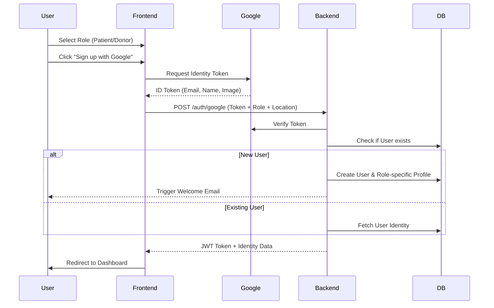
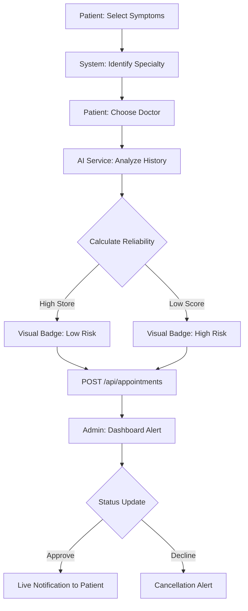
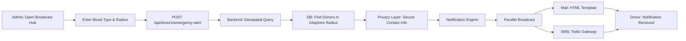
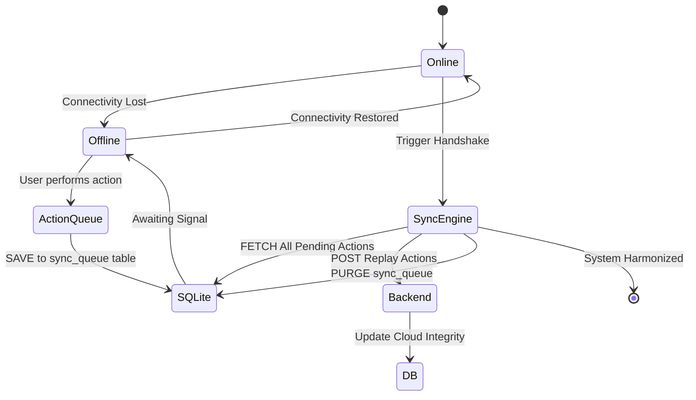
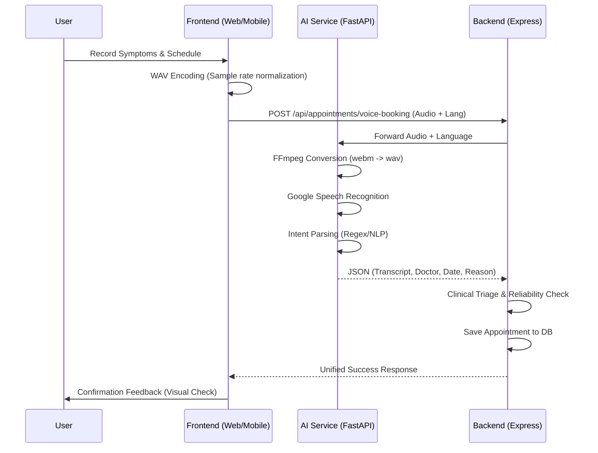
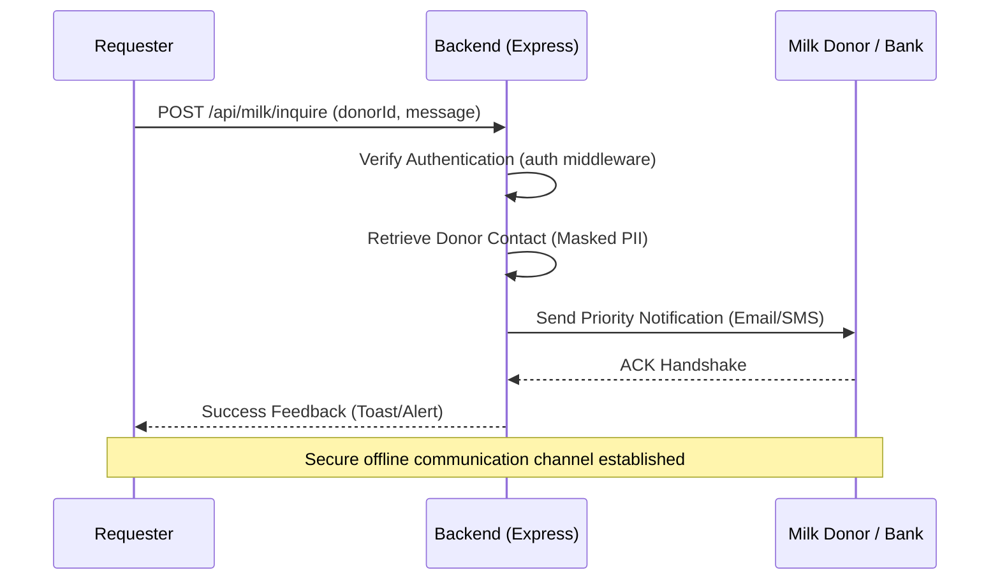

# 🗺️ HealthHub AI: Process Flows

This document visualizes the core logic and user journeys within the HealthHub AI ecosystem. These flows ensure seamless interaction between the **Web Dashboard**, **Mobile App**, **Backend API**, and **AI Service**.

---

## 1. 📂 Identity Onboarding Flow
Standard and Google OAuth registration journeys.

---

## 2. 🩺 Smart Triage & Appointment Flow
From symptom selection to AI-verified booking.

---

## 3. 🚨 Emergency Donor Alert Flow
Geospatial matching and broadcast logic.

---

## 4. 🔄 Offline Data Sync Flow
Maintaining clinical persistence without connectivity.

---

## 5. 🎙️ Neural Voice Interaction Flow
Natural language intent extraction and automated booking.

### 🍼 Human Milk Bank: Secure Handshake Protocol
Privacy-first communication between recipients and donors.

---
*HEALTHHUB AI CORE v1.2 • Communications Layer*
