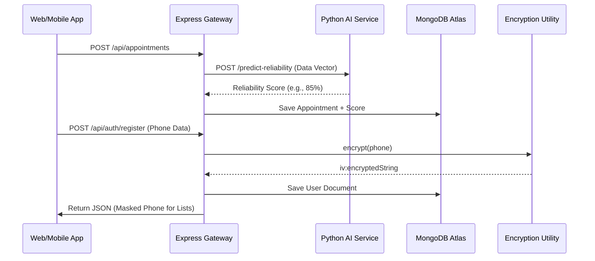

# 🌊 HealthHub: System & Data Flow Architecture

This document outlines the end-to-end operational flow of the HealthHub platform, detailing how users, data, and intelligent services interact.

---

## 1. User Journey Flows

### 🏥 Patient Flow (Booking & History)
1.  **Identity Creation**: Patient registers via Web or Mobile.
2.  **Discovery**: Patient browses available doctors by specialization and experience.
3.  **Booking Pulse**:
    *   **UI Booking**: Selects a slot and provides a reason.
    *   **Voice Booking**: Records a voice message (English/Tamil). The **AI Microservice** performs STT and intent extraction to populate the booking.
4.  **Reliability Engine**: The system calls the **Random Forest ML Model** to calculate a reliability score based on patient history and appointment urgency.
5.  **Dashboard**: Patient views their upcoming appointments on a unified timeline with risk badges.

### 🩺 Doctor Flow (Clinical Management)
1.  **Onboarding**: Admin creates the doctor's account (Doctors cannot register publicly).
2.  **Overview**: Doctor logs in to see an analytical dashboard of today's schedule.
3.  **Triage Prioritization**: Appointments are sorted by AI Triage scores; "Emergency" and "High Risk" cases are pulsed at the top.
4.  **Interaction**: Doctor completes appointments and manages patient status.

### 🩸 Donor Flow (Emergency Supply)
1.  **Protected Registration**: Donor registers (Location permission required). Contact data is instantly **AES-256 Encrypted**.
2.  **Listing**: Donor appears in the localized SmartMatch list.
3.  **Privacy Guard**: Other users see the donor's name and location, but their phone is **masked** (+91 ******1234).
4.  **Emergency Alert**: In a crisis, an Admin/Doctor triggers a broadcast. The backend decrypts the numbers to send SMS/Push notifications via the **Emergency Gateway**.

### 👑 Admin Flow (Governance)
1.  **Intelligence Monitor**: Global view of all platform metrics (Users, Appointments, Network Health).
2.  **Onboarding Pro**: Securely registers medical professionals to the system.
3.  **Audit Logs**: Monitors real-time server activity and AI model status.

---

## 2. Technical Data Flow

---

## 3. Communication Matrix

| Interaction | Mode | Components Involved |
| :--- | :--- | :--- |
| **Real-time Alerts** | Socket.IO | Backend ↔ Frontend (Web/Mobile) |
| **Voice Processing** | REST API | Mobile ↔ Backend ↔ AI Service |
| **Donor Search** | Geospatial | Frontend ↔ MongoDB 2dsphere |
| **Data Sync** | Offline Engine | Mobile SQLite ↔ Backend MongoDB |
| **Security** | Symmetric | Node.js Crypto ↔ Process Env |

---

## 4. Security Gateway Flow

1.  **Request Ingress**: All private requests must carry a `x-auth-token` (JWT).
2.  **RBAC Check**: Middleware verifies if the user's role (e.g., `doctor`) is authorized for the route.
3.  **Data Egress**:
    *   **Sensitive Data**: Automatically decrypted for valid owners/admins.
    *   **Public Data**: Masked by the `privacy.js` utility before leaving the server.

---
*Generated by HealthHub AI Core Documentation Engine.*
